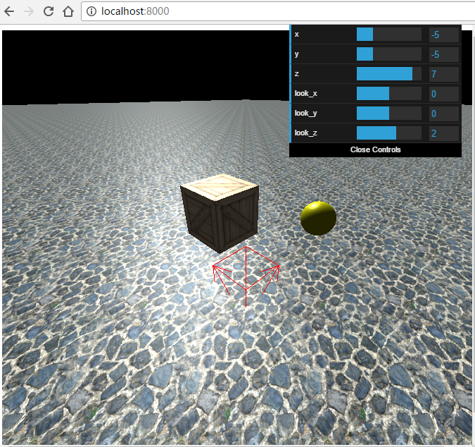

# THREE.js DEMO
A simple demo of THREE.js.
利用了材质贴图与材料等特性，画出的一个真实感场景。

### demo
见`index.html`
或`http://garzon.github.io/THREEjs_Demo`

### 参考资料 References
- Textures from [OpenGameArt](http://opengameart.org/)
- [THREE.js docs](https://threejs.org/docs/index.html)
- [THREE.js tutorial slides](http://davidscottlyons.com/threejs/presentations/frontporch14/)
- GUI: [dat.gui.js](https://github.com/dataarts/dat.gui)